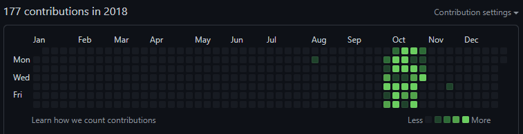

# Git Bomber

## Well, what is it?

This app is build to pollute commit history by writing meaningless information to a file with a given name in a given 
branch in a given period of time a given number of times.

## Green commit history
Had something boring like this?


October looks boring, no commits. Sad. Let's bomb October with 1-10 commits every day! Bombs away!



Whoosh! Amazing commit history :D

## Cheating
It is. Don't use it :)

## Usage
It will not work on repos which have no commits, it will not find the HEAD and die. This is a known issue, 
might be fixed in future. Also don't do something stupid like committing to the 13th century AD, 
the push to github will fail.

It should be enough to run the `jar` with. 
```bash
java -jar git-bomber-1.0-SNAPSHOT-jar-with-dependencies.jar
```

If something doesn't go right, ~~go fix it yourself and submit a PR~~ open an issue, and I'll take a look.

## Support
You can support the app by buying me a coffee :D

[](https://www.buymeacoffee.com/bwca)

## Plans for future
* add tests;
* dockerize maybe? all the kool kids have docker images;
* better random for number of commits per day;
* improve message formatting;
* add non-swearing messages for validation.